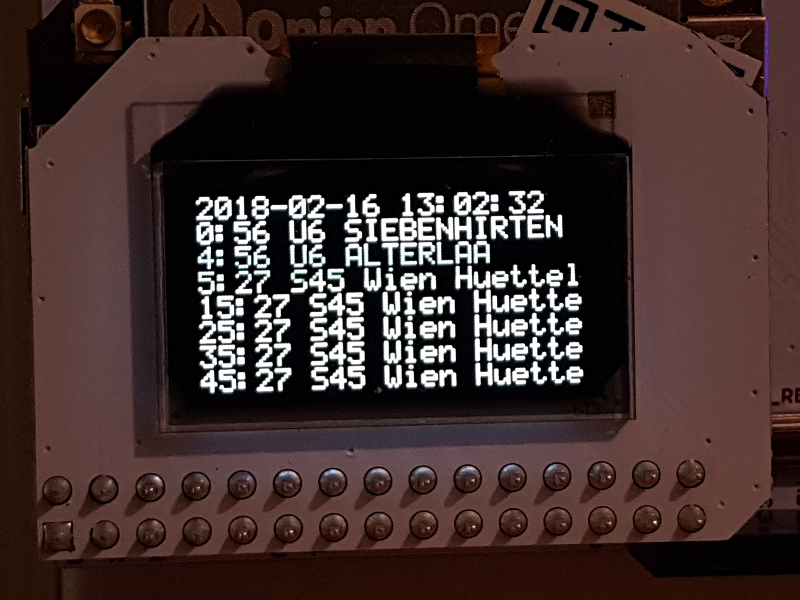

# omeglines



## Configuration

```yaml
wiener_linien:
  api_key: insert api key here
  # optional, default 10 seconds
  update_interval_seconds: 7
  # see csv-haltestellen & csv-steige
  # https://www.data.gv.at/katalog/dataset/add66f20-d033-4eee-b9a0-47019828e698
  rbl: 4648
oebb:
  # see http://fahrplan.oebb.at/bin/stboard.exe/dn
  eva_id: 8101947
  # optional, default 30 seconds
  update_interval_seconds: 17
```
